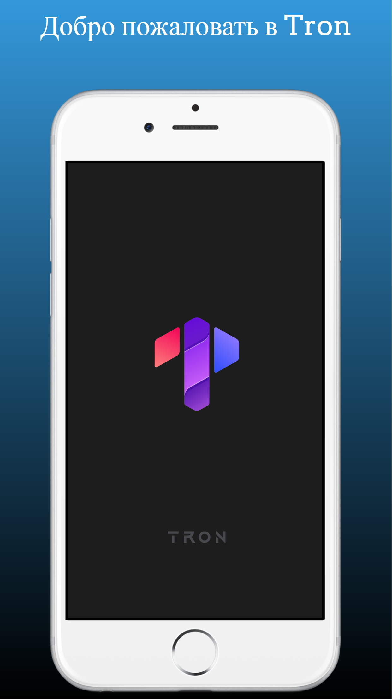
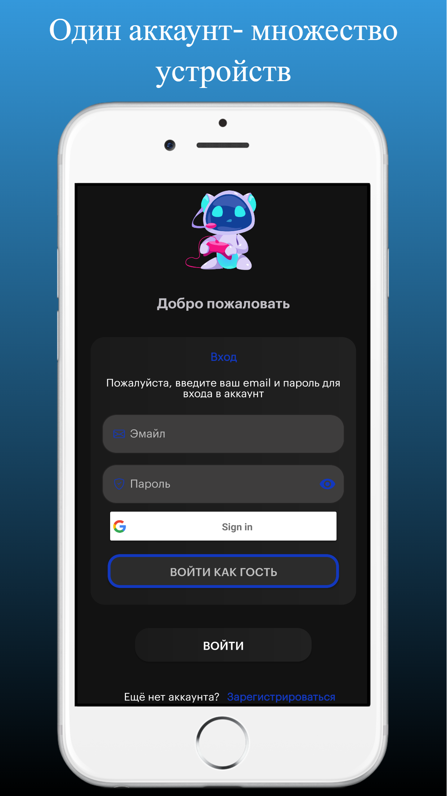
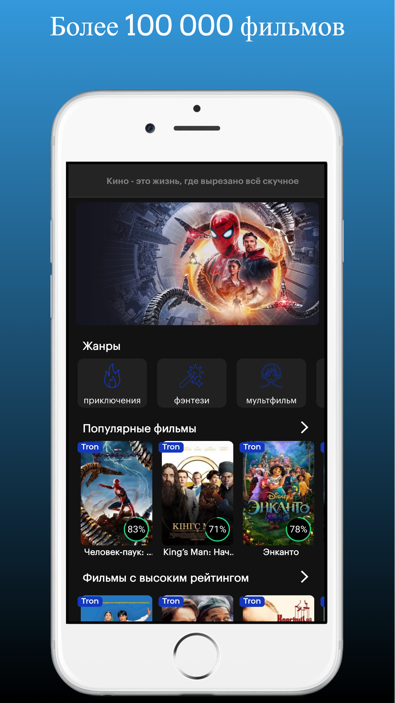
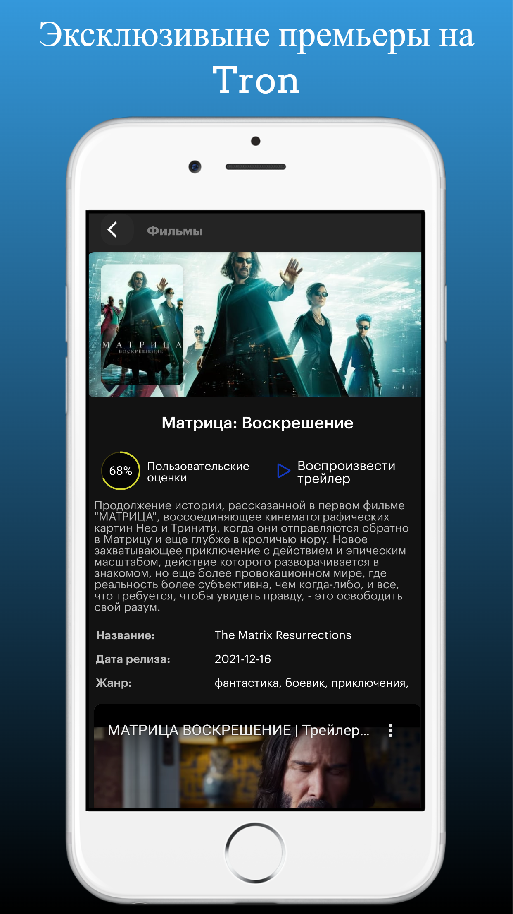

# Tron
Что такое Tron? Да всего лишь очередное приложение.
Приложение реализована на основе:
* **_Clean Architecture_**
* **_MVVM_**
* **_Di (Dagger 2)_**
* **_Retrofit_**
* **_Coroutine_**
* **_LiveData_**
* **_Room_**
* **_Firebase_**
* **_ViewPager_**

**ScreenShots**

    

 

    

