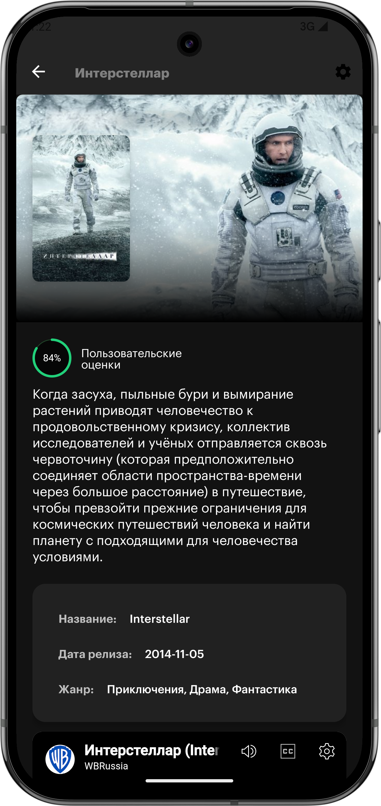
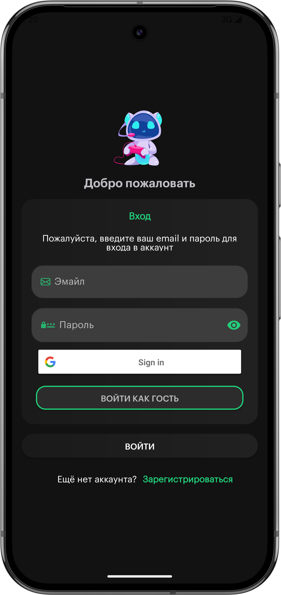
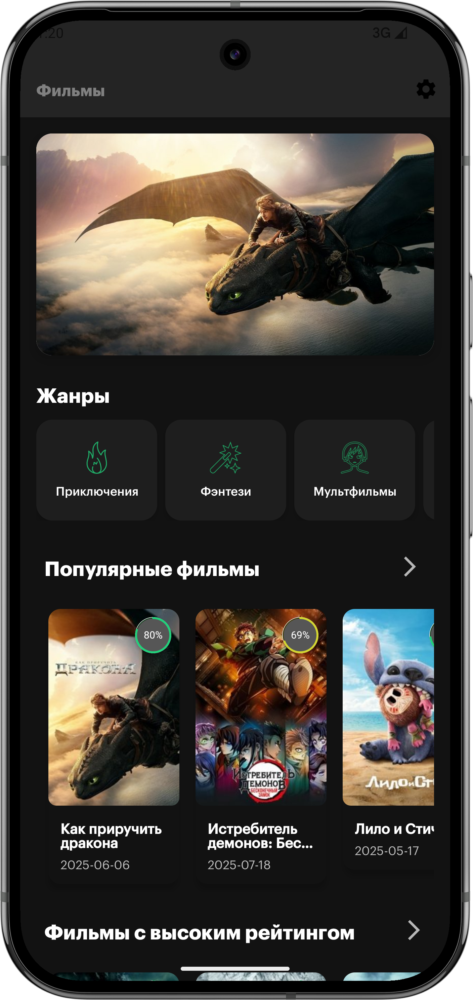

# Tron
Что такое Tron? Да всего лишь очередное приложение.
Приложение реализована на основе:
* **_Kotlin_**
* **_Clean Architecture_**
* **_MVVM_**
* **_Di (Dagger 2)_**
* **_Retrofit_**
* **_Kotlin Coroutine_**
* **_Flow_**
* **_Firebase_**
* **_ViewPager_**
* **_Paging3_**
* **_Splash Api_**
* **_Youtube Api_**

**ScreenShots**

    

 

    

