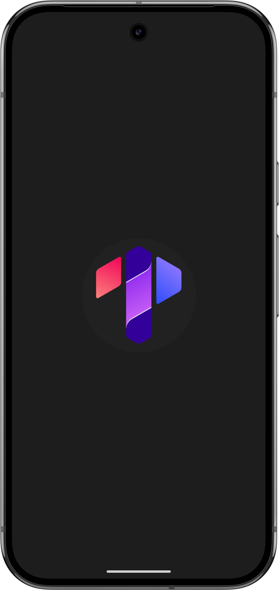

# Trailerly

Trailerly is a modular Android application built with modern Jetpack technologies and clean architecture principles.  
The project showcases a scalable MVVM structure with separation into presentation, domain, and data layers, backed by network and local data sources.

---

## Technology Stack

- Kotlin
- Clean Architecture (app, domain, data modules)
- MVVM (Jetpack ViewModel + LiveData / Flow)
- Dependency Injection via **Dagger 2**
- Retrofit for REST API
- Kotlin Coroutines & Flow
- Firebase services (authentication, real-time database or analytics)
- Jetpack ViewPager
- Paging 3 for paginated lists
- Splash API (Jetpack Splash Screen)
- YouTube Data API integration
- Lottie animations
- Glide for image loading
- XML Data Binding
- Jetpack Navigation Component

---

## Screenshots
## Screenshots

  

    
    
    
    
    
  

---

## Purpose

Trailerly serves as a template project demonstrating:

- Clean separation of concerns and domain-driven design
- Integration with REST APIs and Firebase backend
- Smooth pagination and state handling with Jetpack Paging & Flow
- Scalable dependency injection setup
- Smooth navigation and UI transitions
- Animations and visual polish via Lottie

---
